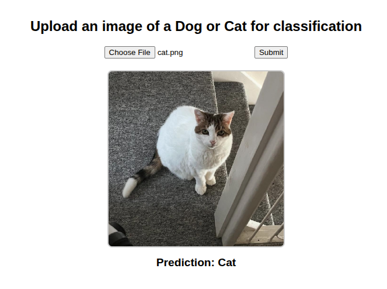

# Cat vs Dog Image Classifier

A convolutional neural network (CNN) based image classifier built with PyTorch, designed to distinguish between images of cats and dogs. The project includes a clean modular structure, dataset preprocessing, model training, and a REST API interface with FastAPI for real-time predictions through a simple web frontend.

---

## Table of Contents

- [Project Overview](#project-overview)  
- [Features](#features)  
- [Dataset](#dataset)  
- [Dataset Folder Structure](#dataset-folder-structure)
- [Model Architecture](#model-architecture)  
- [Installation](#installation)  
- [Usage](#usage)
- [API](#api)  
- [Web Interface](#web-interface)  
- [Training](#training)
- [Evaluation](#evaluation)  
- [Potential Improvements](#potential-improvements)
- [License](#license)  

---

## Project Overview

This project builds a CNN to classify images as either cat or dog. Images are loaded from specified folders, resized, and processed into a dataset used for training and testing. The CNN model is trained using PyTorch, saved, and served through a FastAPI backend. The frontend allows users to upload images and receive instant classification results without page reloads.

---

## Features

- Image preprocessing and dataset creation from folders.  
- Custom CNN implemented in PyTorch.  
- Data loading using PyTorch `DataLoader` for efficient batch training.  
- Model training with real-time progress bars (via `tqdm`).  
- REST API for image classification with FastAPI.  
- Responsive, single-page web interface supporting live image preview and prediction display.  
- Cross-origin resource sharing (CORS) enabled for flexible deployment.

---

## Dataset

- Two classes: Cats (label 0) and Dogs (label 1).  
- Images are resized to 64x64 pixels and normalized before training.
- The dataset used in this project is sourced from [Kaggle: Dog and Cat Classification Dataset](https://www.kaggle.com/datasets/bhavikjikadara/dog-and-cat-classification-dataset) 

---

## Dataset Folder Structure

Organize your dataset in the following directory layout:

```
dataset/
└── data/
├── Cat/
│ ├── cat_image1.jpg
│ ├── cat_image2.png
│ └── ...
└── Dog/
├── dog_image1.jpg
├── dog_image2.png
└── ...
```


- Place all cat images inside the `Cat` folder.  
- Place all dog images inside the `Dog` folder.  
- Supported image formats include JPG, PNG, etc.  
- The code automatically resizes images to 64x64 during preprocessing.

---

## Model Architecture

The CNN model contains:  

- Three **convolutional layers** with increasing channel depths (8, 32, and 64), each followed by **Batch Normalization** and **ReLU** activcation for stable and efficient training.
- **MaxPooling** layers after each convolutional block to progressively reduce spatial dimensions and control overfitting.
- **Adaptive Average Pooling** to produce a fixed-size feature map (4x4) regardless of input dimensions.
- **Dropout layer** before the final classification stage to reduce overfitting.
- **One Fully connected layer** mapping teh flattened features (```64 x 4 x 4```) to the output classses.
- **input size**: Designed for 3-channel RGB images, with flexibility due to adaptive pooling, but commonly trained on 64x64 pixel inputs.

---

## Installation

1. **Clone the repository**  
```bash
git clone https://github.com/LiamUpstoneSmith/cat-vs-dog-classifier.git
cd cat-vs-dog-classifier
```

2. **Set up a python environment**
```
python -m venv venv
source venv/bin/activate  # Linux/macOS
venv\Scripts\activate     # Windows
```

3. **Install dependencies**
```
pip install -r requirements.txt
```

---
## Usage
**Dataset Preparation**
- Ensure you have cat and dog images organized as per the [Dataset Folder Structure](#dataset-folder-structure).

**Training the Model**
- Run the training script:
```
python train.py
```
- This will create the model file model.pth

**Starting the API Server**
- Launch the FastAPI server:
```
uvicorn app:app --reload
```
- This server will be accessible at `http://http://127.0.0.1:8000/`.


## API
- Endpoint: `POST /predict-image/`
- Accepts an image file upload and returns the prediction (`Cat` or `Dog`) as JSON.

## Web Interface

Access the user-friendly web interface by navigating to `http://localhost:8000` in your web browser once the FastAPI server is running. The interface allows you to:

- Upload an image of a cat or dog with a simple file input.  
- Instantly preview the uploaded image before submission.  
- Submit the image for classification without page reloads.  
- View the prediction result displayed directly below the submit button alongside the uploaded image.

This seamless, single-page experience makes it easy to interact with the model in real time.

---

## Training
The model is trained using **PyTorch** with the following steps:

1. Data Loading

- Images are loaded using torch.utils.data.DataLoader for efficient mini-batch training.

- Standard image preprocessing includes resizing to 64×64, normalization, and optional data augmentation (random flips, rotations).

2. Forward Pass

- Input images pass through three convolutional blocks, each consisting of:

  - Convolutional layer

  - Batch Normalization

  - ReLU activation

  - MaxPooling

- Features are aggregated using Adaptive Average Pooling.

- Flattened features pass through a Dropout layer and the final fully connected classification layer.

3. Loss Function

- CrossEntropyLoss is used for multi-class classification.

4. Optimization

- Typically trained with the Adam optimizer (lr=0.0001 by default).

- Learning rate scheduling (e.g., ReduceLROnPlateau) can be applied to improve convergence.

5. Regularization

- Dropout with probability 0.3 before the final layer to prevent overfitting.

- Weight decay (1e-4) can be added to further reduce overfitting.

---

## Evaluation

The model achieves an accuracy of approximately **83.72%** on the held-out test dataset.  

Evaluation metrics:  
- Accuracy: Measures overall correctness of predictions.

While the current model performs reasonably well, it is intended as a baseline and can be further improved with more advanced architectures and training techniques.

### FastAPI Webpage
This is what the webpage looks like. Displaying the image being classified, followed by the prediction from the model.


---

## Potential Improvements

To enhance model performance and usability, consider the following:  

- **Use pretrained CNN backbones** (e.g., ResNet, EfficientNet) to leverage transfer learning.  
- **Incorporate data augmentation** (random rotations, flips, color jitter) to improve generalization.  
- **Increase input resolution** for richer feature extraction.  
- **Add validation split and early stopping** to prevent overfitting.  
- **Experiment with hyperparameter tuning** (learning rate, batch size, optimizer).  
- **Enable GPU acceleration** for faster training and inference.  
- **Enhance the web UI** with additional feedback (loading spinners, error messages).  
- **Containerize the app with Docker** for easier deployment.  
- **Expand dataset diversity** for improved robustness.

---

## License

This project is licensed under the **MIT License**. See the [LICENSE](LICENSE) file for full details.

**Dataset License:**  
The dataset used in this project is sourced from [Kaggle: Dog and Cat Classification Dataset](https://www.kaggle.com/datasets/bhavikjikadara/dog-and-cat-classification-dataset) and is licensed under the [Apache License 2.0](https://www.apache.org/licenses/LICENSE-2.0).  

Please ensure compliance with the dataset license when using or distributing the data. The license for the dataset is separate from the source code license.
